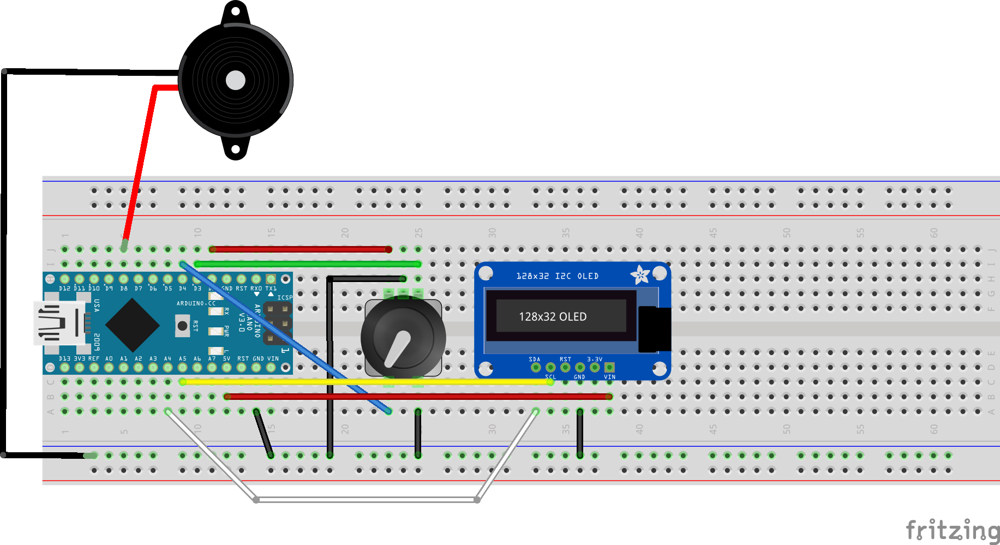

# oled_rotary_encoder

## purpose

training on debouncing values read from a rotary encoder.

## requirements

- arduino nano
- rotary encoder
- oled display
- passive buzzer

Display is a no-name I2C 128x32 monochrome OLED display with 4 pins: GND, VCC, SCL and SDA

## schematics

